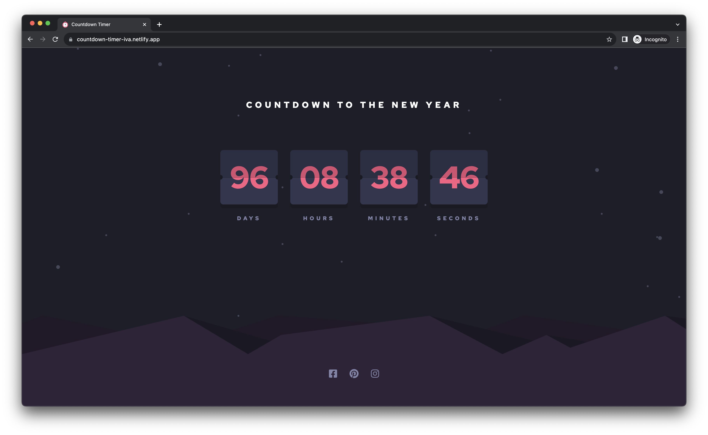

# Countdown timer

This is a solution to the [Launch countdown timer challenge on Frontend Mentor](https://www.frontendmentor.io/challenges/launch-countdown-timer-N0XkGfyz-).

## Table of contents

- [Overview](#overview)
  - [The challenge](#the-challenge)
  - [Screenshot](#screenshot)
  - [Links](#links)
- [Built with](#built-with)

## Overview

### The challenge

Users should be able to:

- See hover states for all interactive elements on the page
- See a live countdown timer that ticks down every second
- When a number changes, make the card flip from the middle

### Screenshot

### Links

Live Site URL: [Countdown timer](https://countdown-timer-iva.netlify.app)

### Built with

- TypeScript
- [React](https://reactjs.org/) - JS library
- [Emotion](https://emotion.sh/docs/introduction) - For styles
- [Day.js](https://day.js.org/en/) - For working with dates
- [Vite](https://vitejs.dev/) - Build setup
